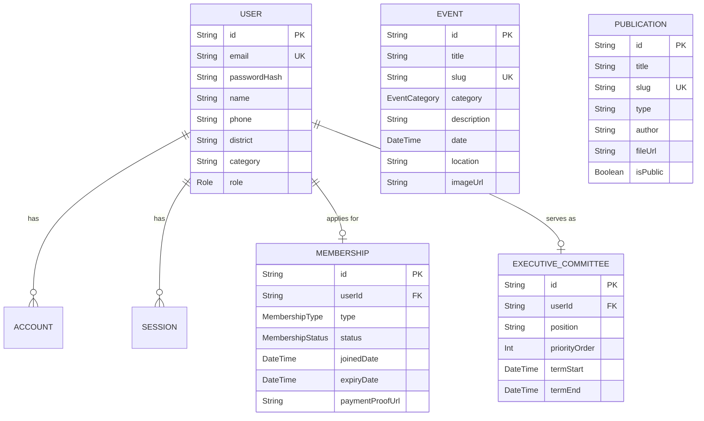

# TeLSA Database Architecture

## ER Diagram

## Prisma Schema Details
(Please refer to the `prisma/schema.prisma` file for the exact models used by the application, including the Auth.js integration).
